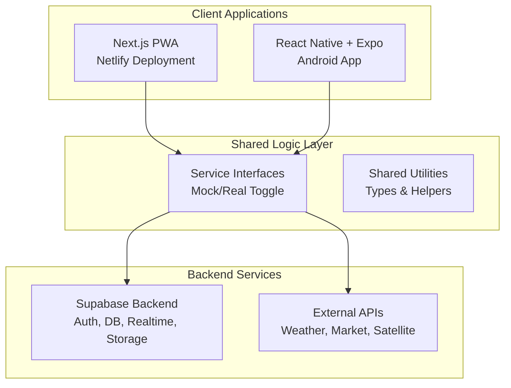

# Design Document

## Overview

AgroClash is designed as a cross-platform gamified agriculture management system with a mock-first, modular architecture. The system consists of three main components: a Next.js PWA for web access, a React Native + Expo mobile app for Android, and a Supabase backend providing authentication, database, real-time updates, and storage services. The architecture prioritizes rapid MVP development through mock services while maintaining the flexibility to progressively integrate real APIs.

## Architecture

### High-Level Architecture



### Service Architecture Pattern

The system implements a service abstraction layer with environment-based toggling:

```typescript
interface WeatherService {
  getForecast(location: Location): Promise<WeatherData>
  getAlerts(location: Location): Promise<Alert[]>
}

class MockWeatherService implements WeatherService { /* mock implementation */ }
class OpenWeatherService implements WeatherService { /* real API */ }

// Environment-based service factory
const weatherService = process.env.USE_MOCK_WEATHER === 'true' 
  ? new MockWeatherService() 
  : new OpenWeatherService()
```

## Components and Interfaces

### Core Service Interfaces

#### 1. Authentication Service
- **Purpose**: Handle user registration, login, and profile management
- **Implementation**: Supabase Auth with email/phone OTP
- **Key Methods**: `signUp()`, `signIn()`, `signOut()`, `updateProfile()`

#### 2. Plot Management Service
- **Purpose**: Handle plot creation, editing, and GeoJSON storage
- **Implementation**: Supabase database with PostGIS extensions
- **Key Methods**: `createPlot()`, `updatePlot()`, `getPlots()`, `calculateArea()`

#### 3. Crop Tracking Service
- **Purpose**: Manage crop lifecycle, status updates, and timeline tracking
- **Implementation**: Supabase with real-time subscriptions
- **Key Methods**: `assignCrop()`, `updateCropStatus()`, `getCropTimeline()`

#### 4. Weather Service
- **Purpose**: Provide weather forecasts and agricultural alerts
- **Mock Implementation**: Static/randomized weather data
- **Real Implementation**: OpenWeatherMap API integration
- **Key Methods**: `getForecast()`, `getAlerts()`, `getHistoricalData()`

#### 5. Market Service
- **Purpose**: Provide crop pricing and marketplace functionality
- **Mock Implementation**: Simulated price fluctuations
- **Real Implementation**: KrishiHub API or web scraping
- **Key Methods**: `getPrices()`, `listCrop()`, `getMarketTrends()`

#### 6. XP Service
- **Purpose**: Handle gamification mechanics, XP calculation, and rewards
- **Implementation**: Supabase with custom business logic
- **Key Methods**: `awardXP()`, `calculateLevel()`, `unlockBadge()`

#### 7. Notification Service
- **Purpose**: Handle push notifications and in-app alerts
- **Implementation**: Expo Push Notifications + Supabase real-time
- **Key Methods**: `sendPushNotification()`, `scheduleAlert()`

### Frontend Components Architecture

#### Web PWA (Next.js)
```
src/
├── components/
│   ├── common/           # Shared UI components
│   ├── maps/            # Leaflet map components
│   ├── dashboard/       # Farm dashboard components
│   └── gamification/    # XP, badges, leaderboards
├── pages/
│   ├── dashboard/       # Main farm dashboard
│   ├── plots/          # Plot management
│   ├── crops/          # Crop tracking
│   ├── market/         # Marketplace
│   └── clan/           # Clan management
├── lib/
│   ├── services/       # Service implementations
│   ├── types/          # TypeScript definitions
│   └── utils/          # Shared utilities
└── hooks/              # Custom React hooks
```

#### Mobile App (React Native + Expo)
```
src/
├── components/         # React Native components
├── screens/           # Screen components
├── navigation/        # React Navigation setup
├── services/          # Shared service layer
└── utils/            # Mobile-specific utilities
```

## Data Models

### Supabase Database Schema

#### Users Table
```sql
CREATE TABLE users (
  id UUID PRIMARY KEY DEFAULT gen_random_uuid(),
  email TEXT UNIQUE NOT NULL,
  name TEXT NOT NULL,
  location POINT,
  xp INTEGER DEFAULT 0,
  level INTEGER DEFAULT 1,
  clan_id UUID REFERENCES clans(id),
  created_at TIMESTAMP DEFAULT NOW(),
  updated_at TIMESTAMP DEFAULT NOW()
);
```

#### Plots Table
```sql
CREATE TABLE plots (
  id UUID PRIMARY KEY DEFAULT gen_random_uuid(),
  user_id UUID REFERENCES users(id) NOT NULL,
  name TEXT NOT NULL,
  geometry GEOMETRY(POLYGON, 4326) NOT NULL,
  area_hectares DECIMAL(10,4) GENERATED ALWAYS AS (ST_Area(geometry::geography) / 10000) STORED,
  created_at TIMESTAMP DEFAULT NOW(),
  updated_at TIMESTAMP DEFAULT NOW()
);
```

#### Crops Table
```sql
CREATE TABLE crops (
  id UUID PRIMARY KEY DEFAULT gen_random_uuid(),
  plot_id UUID REFERENCES plots(id) NOT NULL,
  name TEXT NOT NULL,
  variety TEXT,
  sown_date DATE NOT NULL,
  expected_harvest_date DATE,
  status TEXT DEFAULT 'planted',
  growth_stage TEXT DEFAULT 'seedling',
  created_at TIMESTAMP DEFAULT NOW(),
  updated_at TIMESTAMP DEFAULT NOW()
);
```

#### XP Logs Table
```sql
CREATE TABLE xp_logs (
  id UUID PRIMARY KEY DEFAULT gen_random_uuid(),
  user_id UUID REFERENCES users(id) NOT NULL,
  action_type TEXT NOT NULL,
  xp_awarded INTEGER NOT NULL,
  description TEXT,
  created_at TIMESTAMP DEFAULT NOW()
);
```

#### Clans Table
```sql
CREATE TABLE clans (
  id UUID PRIMARY KEY DEFAULT gen_random_uuid(),
  name TEXT UNIQUE NOT NULL,
  description TEXT,
  leader_id UUID REFERENCES users(id),
  member_count INTEGER DEFAULT 0,
  total_xp INTEGER DEFAULT 0,
  created_at TIMESTAMP DEFAULT NOW()
);
```

### Row Level Security (RLS) Policies

```sql
-- Users can only access their own data
ALTER TABLE plots ENABLE ROW LEVEL SECURITY;
CREATE POLICY "Users can manage their own plots" ON plots
  FOR ALL USING (auth.uid() = user_id);

-- Clan members can view each other's basic stats
CREATE POLICY "Clan members can view stats" ON users
  FOR SELECT USING (
    clan_id IS NOT NULL AND 
    clan_id = (SELECT clan_id FROM users WHERE id = auth.uid())
  );
```

## Error Handling

### Client-Side Error Handling
- **Network Errors**: Implement retry logic with exponential backoff
- **Offline Handling**: Queue operations for sync when connectivity returns
- **Validation Errors**: Provide clear user feedback with field-specific messages
- **Service Failures**: Graceful degradation to cached data or mock services

### Backend Error Handling
- **Database Errors**: Proper error logging and user-friendly messages
- **API Rate Limits**: Implement caching and request throttling
- **Authentication Errors**: Clear session management and re-authentication flows
- **Data Validation**: Server-side validation with detailed error responses

### Error Recovery Strategies
```typescript
class ErrorHandler {
  static async handleServiceError(error: ServiceError, fallback?: () => any) {
    if (error.type === 'NETWORK_ERROR') {
      return await this.retryWithBackoff(error.originalRequest)
    }
    if (error.type === 'API_LIMIT_EXCEEDED') {
      return await this.useCachedData(error.resource)
    }
    return fallback ? fallback() : this.showUserError(error)
  }
}
```

## Testing Strategy

### Unit Testing
- **Service Layer**: Mock external dependencies, test business logic
- **Components**: React Testing Library for UI component testing
- **Utilities**: Jest for pure function testing
- **Database**: Supabase local development with test data

### Integration Testing
- **API Integration**: Test service interfaces with both mock and real implementations
- **Database Operations**: Test CRUD operations and RLS policies
- **Authentication Flow**: End-to-end auth testing with Supabase
- **Real-time Features**: Test WebSocket connections and data synchronization

### End-to-End Testing
- **User Workflows**: Playwright for critical user journeys
- **Cross-Platform**: Test PWA and mobile app feature parity
- **Offline Scenarios**: Test offline functionality and sync behavior
- **Performance**: Load testing for concurrent users and large datasets

### Testing Environment Setup
```typescript
// Test configuration
const testConfig = {
  supabase: {
    url: process.env.SUPABASE_TEST_URL,
    anonKey: process.env.SUPABASE_TEST_ANON_KEY
  },
  services: {
    useMocks: true, // Always use mocks in tests
    mockDataSeed: 'consistent-test-data'
  }
}
```

### Mock Data Strategy
- **Consistent Test Data**: Seeded mock data for predictable testing
- **Realistic Scenarios**: Mock data that reflects real-world usage patterns
- **Edge Cases**: Mock data covering error conditions and boundary cases
- **Performance Testing**: Large datasets for testing scalability

The design ensures scalability, maintainability, and rapid development while providing a solid foundation for progressive enhancement with real API integrations.